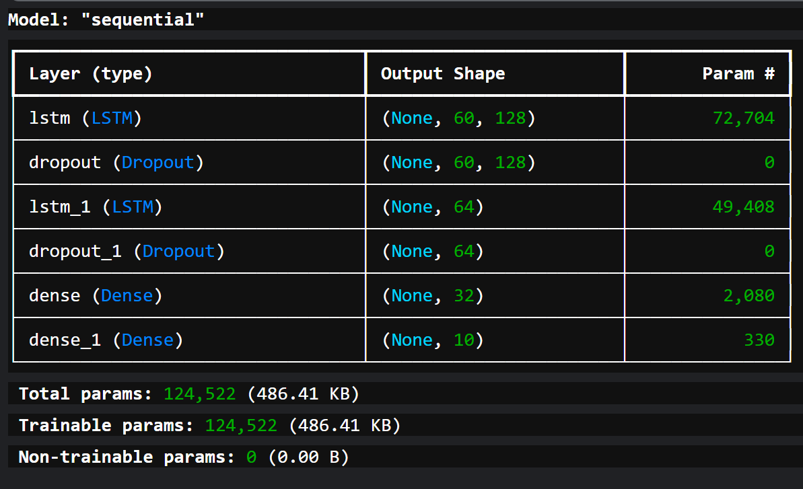
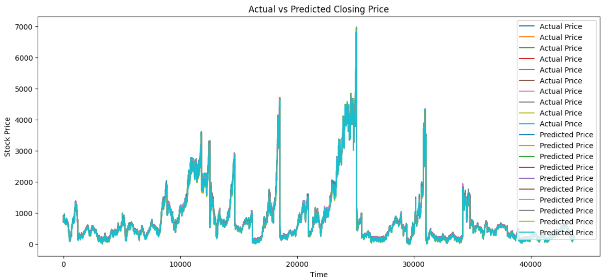
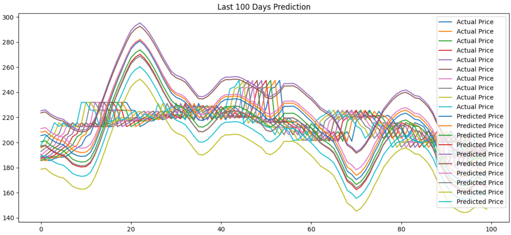

# SignalMatrix AI — Multi-Step Market Forecasting System

> AI-Powered 10-Day NIFTY 50 Stock Price Forecasting & Strategy Evaluation Platform

[](https://www.python.org/downloads/release/python-3100/)
[](https://www.tensorflow.org/api_docs/python/tf/keras)
[](https://arxiv.org/abs/1506.02078)
[](https://streamlit.io/)
[](https://plotly.com/python/)
[](https://www.nseindia.com/report-detail/eq_security)
[](https://www.docker.com/)

---

## Problem Statement

Retail investors and analysts often lack accessible tools to forecast short-term market trends from raw price data. SignalMatrix AI addresses this by providing a browser-based, no-code interface that takes NSE stock CSV exports, applies a trained LSTM model, and returns a 10-day forward price forecast with validation metrics — all without requiring any machine learning expertise.

---

## Pipeline

```
NSE India CSV Export (OHLC Daily Data)
        │
        ▼
Data Preprocessing
  Column normalization · Type casting · Date sorting · NaN removal
        │
        ▼
Feature Engineering (13 Features)
  MA_20 · EMA_20 · RSI · MACD · Signal Line · Bollinger Bands (Upper/Middle/Lower)
        │
        ▼
MinMaxScaler Normalization  (scaler.pkl)
        │
        ▼
60-Day Lookback Window  →  LSTM Seq2Seq Model  (lstm_model.keras)
  Layer 1: LSTM(128) + Dropout
  Layer 2: LSTM(64)  + Dropout
  Dense Head → 10-Step Output
        │
        ▼
Inverse Transform  →  Additive Bias Correction  →  EWM Smoothing
        │
        ▼
Plotly Chart  +  Validation Metrics (MAE / RMSE / Directional Accuracy)
        │
        ▼
Streamlit App  (app.py)
```

---

## Key Features

- **10-Day Multi-Step Forecast** — predicts a full 10-trading-day sequence, not just next-day
- **Validation Mode** — compare AI forecast against real data; computes MAE, RMSE, and Directional Accuracy
- **13 Engineered Features** — OHLC + MA, EMA, RSI, MACD, Signal Line, Bollinger Bands
- **Stock Symbol Auto-Detection** — reads from CSV `Symbol` column or extracts from filename
- **Additive Bias Correction + EWM Smoothing** — corrects scale drift between last known close and first forecast step
- **NSE-Compatible CSV Format** — handles NSE's default column names (`Open Price`, `High Price`, etc.) automatically
- **Docker-Ready** — `Dockerfile` + `.dockerignore` included for containerised deployment
- **Interactive Plotly Charts** — Historical (blue) · Forecast (red) · Validation Actual (orange)

---

## Model Architecture

```
Input Shape: (batch, 60, 13)
        │
        ▼
LSTM(128, return_sequences=True) → Dropout
        │
LSTM(64,  return_sequences=False) → Dropout
        │
Dense(64) → Dense(32) → Dense(10)
        │
Output Shape: (batch, 10)   ← 10-day price forecast
```



| Parameter | Value |
|---|---|
| Architecture | Stacked LSTM (Seq2Seq) |
| LSTM Units | 128 → 64 |
| Lookback Window | 60 trading days |
| Forecast Horizon | 10 trading days |
| Total Parameters | **124,522** |
| Regularization | Dropout |
| Output Activation | Linear |

---

## Training Performance

| Metric | Value |
|---|---|
| RMSE | 135.78 |
| MAE | 58.60 |
| MAPE | 14.23% |
| R² Score | **0.9766** |

### Training Visualization — Actual vs Predicted (Full Dataset)



### Last 100 Days Prediction Behavior



---

## Dataset

**Source:** [NSE India — Equity Security Data](https://www.nseindia.com/report-detail/eq_security)

| Split | Rows (approx.) | Description |
|---|---|---|
| Training | ~1,75,000 | 5 years of NIFTY 50 combined stock data (all 50 symbols) |
| Validation | ~45,000 | Held-out combined NIFTY 50 data |

| Column | Description |
|---|---|
| Date | Trading date |
| Open | Opening price of the session |
| High | Intraday high |
| Low | Intraday low |
| Close | Session closing price ← **prediction target** |
| Symbol | NIFTY 50 stock ticker (encoded via `stock_mapping.pkl`) |

> **Note:** NSE exports use column names like `Open Price`, `High Price`, etc. The app renames these automatically.

---

## Feature Engineering

The model uses **13 features** derived from raw OHLC price data:

| Feature | Description |
|---|---|
| `Symbol` | Encoded stock identifier (from `stock_mapping.pkl`) |
| `Open` | Opening price |
| `High` | Intraday high |
| `Low` | Intraday low |
| `Close` | Closing price — prediction target |
| `MA_20` | 20-day Simple Moving Average — medium-term trend |
| `EMA_20` | 20-day Exponential Moving Average — recent-price weighted |
| `RSI` | Relative Strength Index (14-day) — overbought/oversold signal |
| `MACD` | EMA(12) − EMA(26) — momentum shift indicator |
| `Signal_Line` | 9-day EMA of MACD — crossover detection |
| `BB_Middle` | 20-day rolling mean — Bollinger Band centre |
| `BB_Upper` | Middle + 2σ — volatility resistance level |
| `BB_Lower` | Middle − 2σ — volatility support level |

---

## Chart Legend

| Line Colour | Meaning |
|---|---|
| 🔵 Blue | Last 60 days of historical close prices |
| 🔴 Red | AI 10-day forecast |
| 🟠 Orange | Validation Actual (only shown when Validation Mode is enabled) |

---

## Project Structure

```
SignalMatrix-AI/
├── app.py                      # Streamlit frontend + inference pipeline
├── lstm_model.keras            # Trained LSTM model weights
├── scaler.pkl                  # Fitted MinMaxScaler
├── stock_mapping.pkl           # NIFTY 50 symbol → integer encoding map
├── NIFTY50_all.csv             # Full training dataset (NSE export)
├── model_architecture.png      # LSTM architecture diagram
├── training_actual_vs_pred.png # Full dataset actual vs predicted chart
├── last_100_days.png           # Last 100 days forecast behaviour plot
├── logo.png                    # App logo (used in Streamlit header)
├── requirements.txt            # Python dependencies
├── Dockerfile                  # Container build file
└── .dockerignore               # Docker ignore rules
```

---

## Quickstart

### Local (Python)

```bash
# Clone repository
git clone https://github.com/Akshbhimani08/SignalMatrix-AI.git
cd SignalMatrix-AI

# Install dependencies
pip install -r requirements.txt

# Run app
streamlit run app.py
```

### Docker

```bash
docker build -t signalmatrix-ai .
docker run -p 8501:8501 signalmatrix-ai
```

Then open `http://localhost:8501` in your browser.

---

## How to Use

### Step 1 — Select Mode
| Mode | Description |
|---|---|
| 🚀 Future Forecast | Upload stock CSV → get 10-day price forecast |
| 📊 Why Choose This Model? | View training metrics, architecture, and feature descriptions |

### Step 2 — Upload NSE Stock Data
- Download from [NSE India](https://www.nseindia.com/report-detail/eq_security) → Equity Security → Historical Data
- File must be `.csv` or `.xlsx`
- Must contain: `Date`, `Open` / `Open Price`, `High` / `High Price`, `Low` / `Low Price`, `Close` / `Close Price`
- **Minimum 80 rows required** (≈ 4 months of trading data)

### Step 3 — Generate Forecast
- Click **Run** to generate the 10-day forecast
- Optionally enable **Validation Mode** (requires 80+ rows) to compare forecast vs actual prices

### Step 4 — Interpret Results
- Red line = AI Forecast
- Orange line = Validation Actual (if enabled)
- Blue line = Historical Data
- Metrics: MAE · RMSE · Directional Accuracy

---

## Validation Metrics Explained

| Metric | Formula | Interpretation |
|---|---|---|
| MAE | mean(\|actual − predicted\|) | Average absolute error in ₹ |
| RMSE | √mean((actual − predicted)²) | Penalises large errors more heavily |
| Directional Accuracy | % correct trend direction (up/down) | How often the model gets the movement direction right |

---

## Important Notes

- Model trained on **NIFTY 50 index stocks only** — accuracy on mid/small-cap stocks outside the index is not guaranteed
- Uses a **60-day lookback window** — upload at least 4 months of data for best results
- **Additive bias correction** is applied post-inference to anchor the first predicted point to the last known close price
- **EWM smoothing (span=3)** is applied to reduce step-to-step prediction noise
- This is an **educational project** — not intended for live trading or financial advice

---

## References

- Hochreiter, S. & Schmidhuber, J. (1997). *Long Short-Term Memory.* Neural Computation. [doi:10.1162/neco.1997.9.8.1735](https://doi.org/10.1162/neco.1997.9.8.1735)
- Sutskever, I. et al. (2014). *Sequence to Sequence Learning with Neural Networks.* [arXiv:1409.3215](https://arxiv.org/abs/1409.3215)
- NSE India — [Historical Equity Data](https://www.nseindia.com/report-detail/eq_security)
- Streamlit — [streamlit.io](https://streamlit.io/)
- Plotly Python — [plotly.com/python](https://plotly.com/python/)

---

## Citation

```
@misc{signalmatrix2025,
  author       = {Aksh Bhimani},
  title        = {SignalMatrix AI: Multi-Step LSTM Forecasting for NIFTY 50 Stocks},
  year         = {2025},
  howpublished = {\url{https://github.com/Akshbhimani08/SignalMatrix-AI}},
  note         = {Streamlit · TensorFlow · LSTM Seq2Seq · NSE India Data}
}
```

---

## Author

**Aksh Bhimani**

---
Made for learning financial AI and time-series forecasting.
